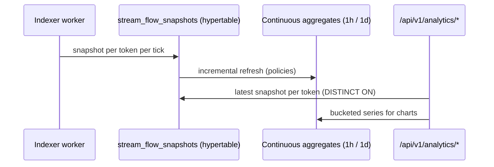

# Analytics — TimescaleDB TVL & velocity (#1480)

Protocol TVL, uncollected claims and streaming velocity change every second,
so they are **snapshotted into a hypertable** and pre-aggregated with
continuous aggregates instead of being recomputed from raw tables on every
request.

## Pipeline

## Endpoints

| Endpoint | Purpose |
|---|---|
| `GET /api/v1/analytics/tvl` | Current TVL partitioned by token (`source: timescaledb \| live`) |
| `GET /api/v1/analytics/historical?period=30d&interval=1d` | `7d/30d/90d/1y` × `1h/1d` chart series |
| `GET /api/v1/analytics/defillama` | DefiLlama adapter payload |

## Degradation

If the TimescaleDB extension or the hypertable is missing, `/tvl` falls back
to live aggregation over the `Stream` table (`source: "live"`) and
`/historical` returns an empty series — stock PostgreSQL deployments keep
working, they just lose the pre-aggregation.
