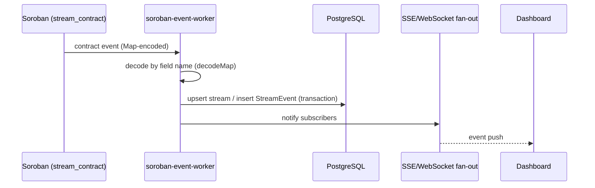

# Event ingestion

## Contract

- Events are emitted as **Soroban Maps** keyed by field name, so decoding is
  order-independent. The pinned field/type table lives in
  `backend/tests/events-wire-format.test.ts`.
- Ingestion is **idempotent**: event identity is `(contract, topic, ledger,
  index)`, so replays are no-ops.
- The worker stores its cursor in Postgres (`INDEXER_STATE_ID`), so restarts
  resume rather than rewind.

## Failures

Decode or persistence failures land in the dead-letter table for triage —
see [dead-letter triage](./dead-letter-triage.md).
