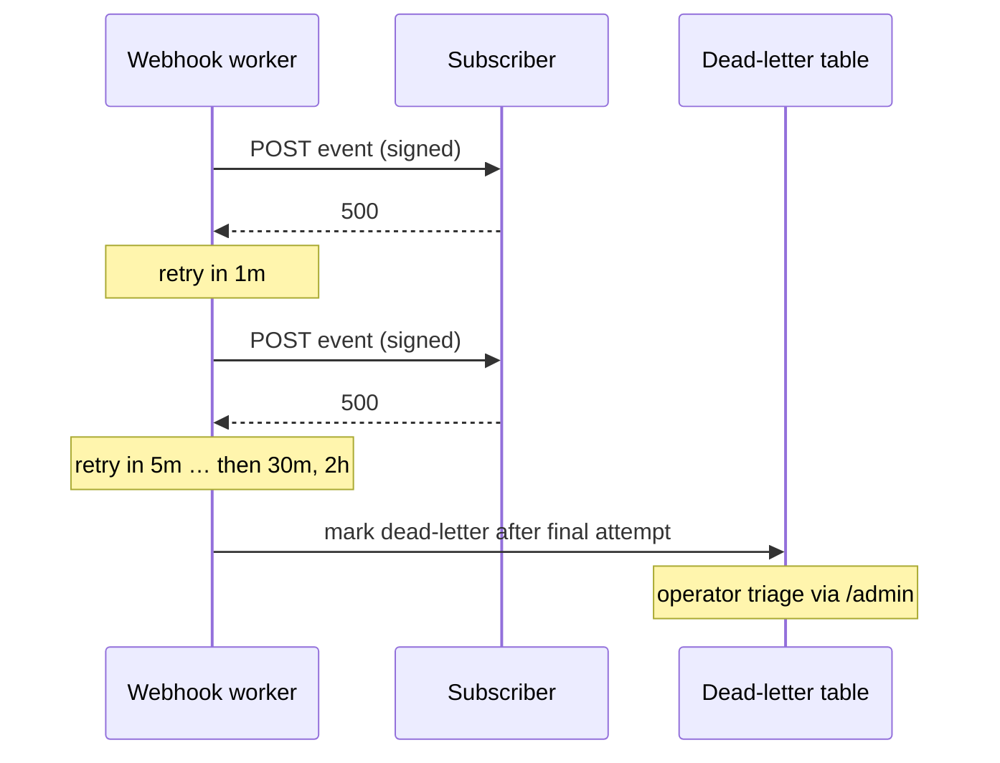

# Webhooks

Outbound webhook deliveries notify integrators when their wallet is touched
by an indexed event.

## Delivery contract

- `POST` to the subscriber's URL with an HMAC signature header
  (`X-FlowFi-Signature`) over the raw body.
- Retries use **exponential backoff** on non-2xx responses and timeouts:
  30s → 1m → 5m → 30m → 2h (six attempts), then dead-letter.



## Verifying signatures

```python
import hmac, hashlib

def verify(secret: str, raw_body: bytes, header: str) -> bool:
    expected = hmac.new(secret.encode(), raw_body, hashlib.sha256).hexdigest()
    return hmac.compare_digest(expected, header.removeprefix("sha256="))
```
