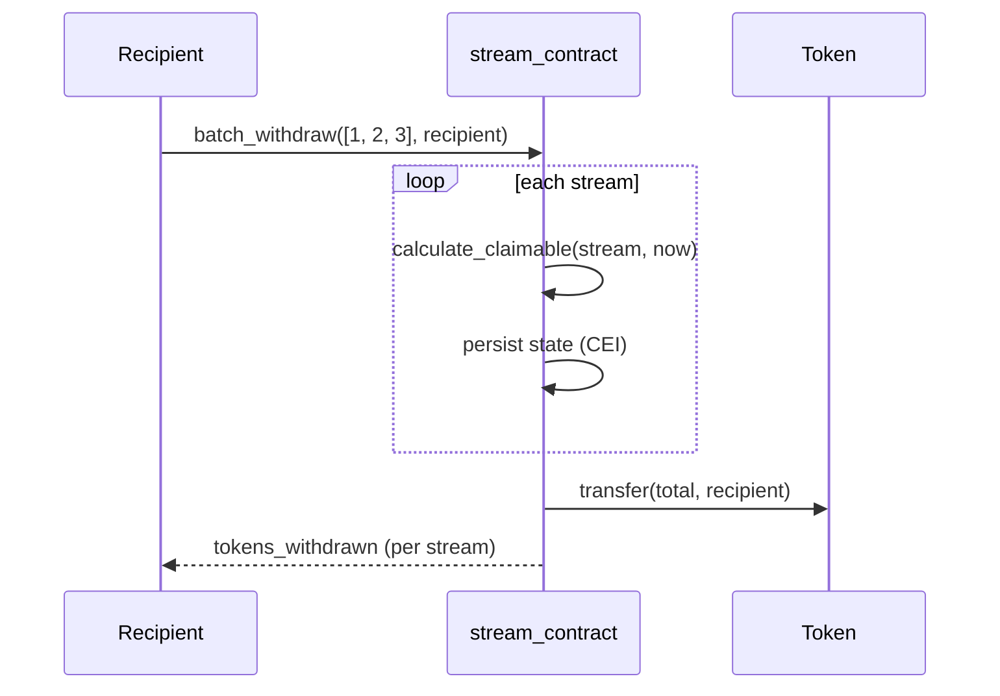

# Batch operations

`batch_withdraw(stream_ids, recipient)` withdraws up to
[`MAX_BATCH_WITHDRAW`](https://github.com/LabsCrypt/flowfi/blob/main/contracts/stream_contract/src/types.rs)
(30) streams in one transaction — one signature, one fee, N payouts.

## Semantics

- The **first failure aborts the whole batch** — partial withdrawals do not
  happen; Soroban rolls the transaction back.
- Each stream is validated (active, recipient-owned) before its accrual is
  added, so a paused or cancelled id fails loudly instead of silently
  withdrawing zero.
- Per-stream `tokens_withdrawn` events keep indexers simple: the batch is
  just N normal withdrawals sharing one transaction.
