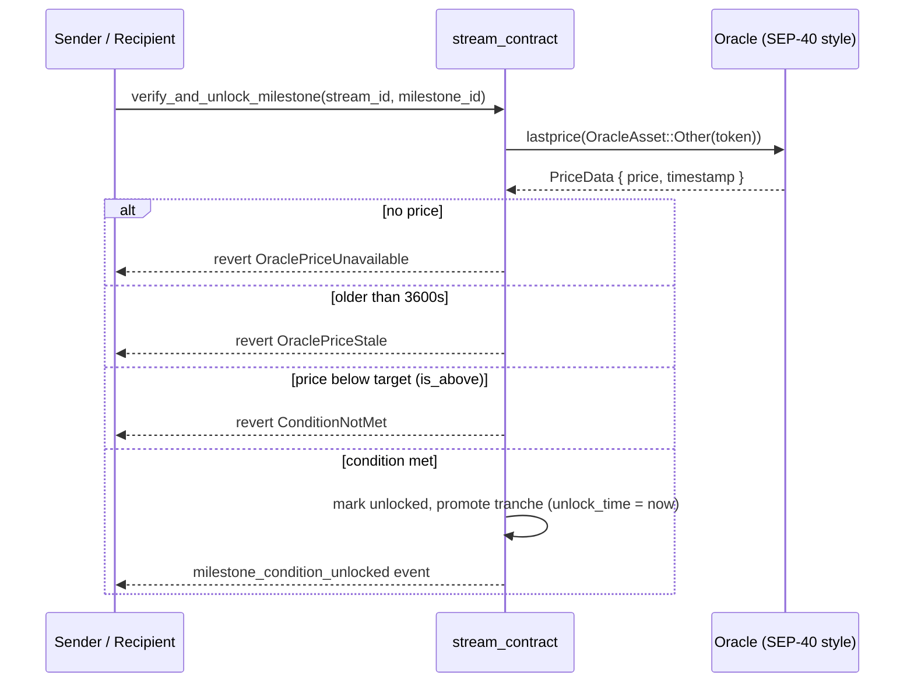

# Conditional streams — oracle-gated milestones

`create_conditional_stream` escrows a deposit against
[`ConditionalMilestone`](https://github.com/LabsCrypt/flowfi/blob/main/contracts/stream_contract/src/types.rs)
tranches. Unlike step tranches, **nothing unlocks by time alone** — each
tranche waits for its condition to verify true.

## Unlock conditions

```rust
pub enum UnlockCondition {
    /// Unlocks at a fixed timestamp (for mixed schedules).
    TimeOnly(u64),
    /// Unlocks when the oracle price crosses target_price.
    PriceTarget(Address /* oracle */, i128 /* target */, bool /* is_above */),
    /// Unlocks when the named oracle signer authorizes this attestation id.
    OracleAttestation(Address /* oracle_signer */, BytesN<32> /* id */),
}
```

## Verification flow



## Guarantees

- **Freshness** — price readings older than `ORACLE_PRICE_MAX_AGE_SECS`
  (3600s) are rejected; a stale feed can never release funds.
- **Attestation single-use** — an attestation id is recorded per stream; the
  same id can never unlock two milestones.
- **Signer authorization** — `OracleAttestation` requires the named oracle
  signer to authorize the verification call itself, so naming a signer is not
  enough.
- **Escrow equals schedule** — milestone amounts must sum to the post-fee
  deposit, so the contract never promises more than it holds.
- **Reuse of the proven path** — verification only rewrites the tranche's
  unlock time; claim math, withdrawal and events stay the audited
  step-tranche code.

## Example

```ts
const milestones = [
  {
    milestone_id: 1,
    amount: 500_000_000n,
    condition: {
      PriceTarget: [oracleAddress, 450_00000n /* $0.45 */, true /* is_above */],
    },
    is_unlocked: false,
  },
  {
    milestone_id: 2,
    amount: 500_000_000n,
    condition: { OracleAttestation: [oracleSigner, attestationId] },
    is_unlocked: false,
  },
];

await client.createConditionalStream({ sender, recipient, token, amountStroops, milestones });
// later, when the KPI lands (sender or recipient may trigger):
await client.verifyAndUnlockMilestone({ caller, streamId, milestoneId: 1 });
```
