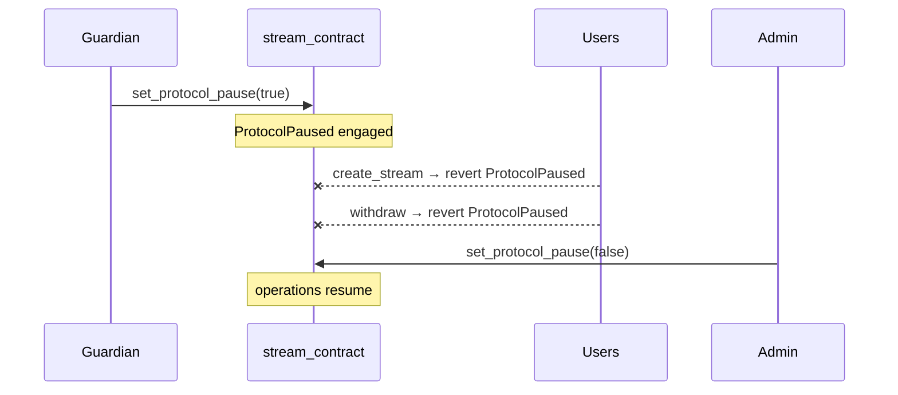

# Emergency pause & guardian

Two independent roles can halt the protocol:

| Role | Set by | Can |
|---|---|---|
| **Admin** | `transfer_admin` | Everything, including `update_fee_config` |
| **Emergency guardian** | `set_emergency_guardian` (admin) | `set_protocol_pause(true)` only |

## Circuit breaker

`set_protocol_pause(env, caller, paused)` engages or lifts the breaker. While
engaged, `create_stream` (and every create variant) and `withdraw` revert with
`ProtocolPaused`. Read-only views keep working, so dashboards stay truthful
during an incident.

## Why a guardian

If the admin key is compromised or lost, a second, independently-held key can
still stop the bleeding. The guardian cannot steal funds — it can only pause —
which makes delegating it to a multisig or a trusted party risk-free.

