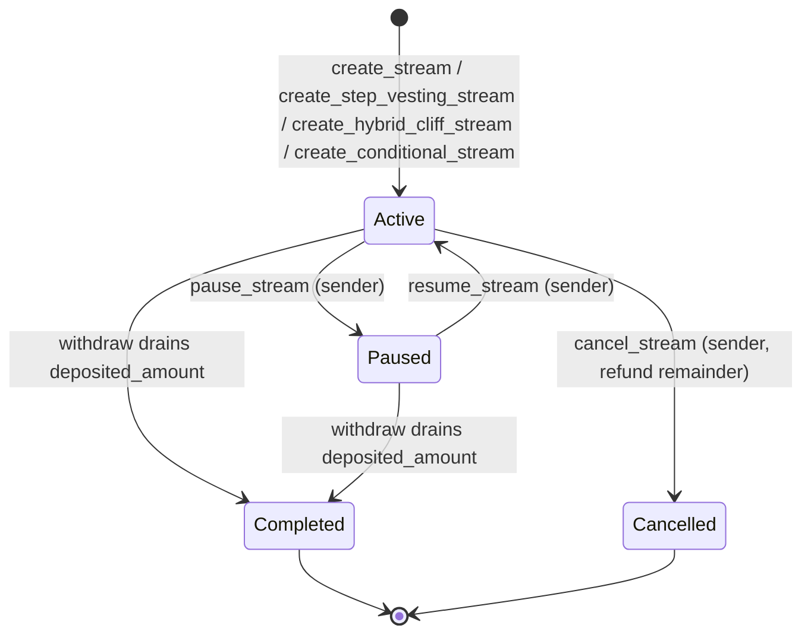

# Stream lifecycle

## Invariants

1. **A cancelled stream can never be resumed**, even if `paused` is true.
   `resume_stream` checks status first and reverts otherwise.
2. **CEI ordering** — every state change is persisted *before* the token
   transfer, so a failing transfer cannot desync storage.
3. **Fees are deducted at creation** — `deposited_amount` is the net figure
   the recipient's schedule is computed against.

## Entry points

| Function | Caller | Effect |
|---|---|---|
| `create_stream` | sender | Escrows amount, starts a linear drip |
| `create_step_vesting_stream` | sender | Escrows amount against dated tranches |
| `create_hybrid_cliff_stream` | sender | Cliff lump sum + linear tail |
| `create_conditional_stream` (#1482) | sender | Escrows amount against KPI-gated milestones |
| `withdraw` / `batch_withdraw` | recipient | Transfers the claimable amount |
| `pause_stream` / `resume_stream` | sender | Freezes/unfreezes accrual |
| `cancel_stream` | sender | Refunds the sender, pays out accrued |
| `top_up_stream` | sender | Extends a linear stream's deposit |

Read-only views: `get_stream`, `get_claimable_amount`,
`get_vesting_schedule`, `get_projected_end_time`, `is_stream_completed`.
